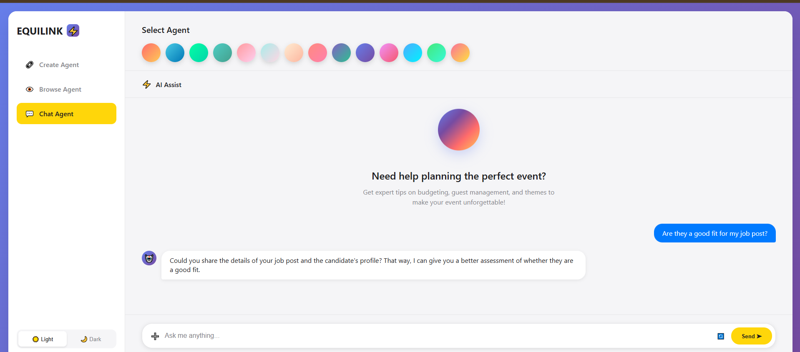

# AI Agent Dashboard Design

**This repository contains the front-end design for an AI Agent Dashboard, built using HTML, CSS, and JavaScript. The dashboard provides an intuitive interface for interacting with various AI agents, including features for creating, browsing, and chatting with agents.**

## Features

* **Agent Selection:** Easily switch between different AI agents using a vibrant color-coded selection bar.
* **AI Assist:** A dedicated section for general AI assistance.
* **Chat Interface:** A clean and responsive chat window for real-time conversations with AI agents.
* **Dark/Light Mode Toggle:** Seamlessly switch between light and dark themes for improved user experience.
* **Responsive Design:** The layout is designed to be adaptable across various screen sizes.

## Screenshot

**Here's a preview of the AI Agent Dashboard:**

## Technologies Used

* **HTML5:** For the basic structure and content of the web pages.
* **CSS3:** For styling and layout, including responsive design and visual effects.
* **JavaScript:** For interactive elements, dynamic content, and functionality.

## Setup and Usage

**To run this project locally, follow these steps:**

1. **Clone the repository:**
   ```
   git clone https://github.com/MuhammadArshadKhokhar/AI-Agent-Dashboard-Design.git

   ```
2. **Navigate to the project directory:**
   ```
   cd ai-agent-dashboard

   ```
3. **Open `<span class="selected">index.html</span>`:**
   Simply open the `<span class="selected">index.html</span>` file in your preferred web browser.

## Project Structure

```
.
├── index.html
├── style.css
├── script.js

```

## Contributing

**Contributions are welcome! If you have suggestions for improvements or new features, please feel free to open an issue or submit a pull request.**

## License

**This project is open-source and available under the **[MIT License](https://www.google.com/search?q=LICENSE "null").
